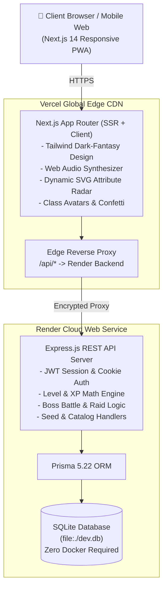

# ⚔️ Life RPG — Realm of Progression

## 🌐 Live Production Deployments

| Component            | Platform                      | URL                                                                                                        | Status                    |
| :------------------- | :---------------------------- | :--------------------------------------------------------------------------------------------------------- | :------------------------ |
| **Frontend Web App** | **Vercel** (Global Edge CDN)  | **[https://life-rpg-eight-teal.vercel.app/](https://life-rpg-eight-teal.vercel.app/)**                     | 🟢 **Live & Operational** |
| **Backend REST API** | **Render** (Node.js + Prisma) | **[https://life-rpg-team-deltacharlie.onrender.com/](https://life-rpg-team-deltacharlie.onrender.com/)**   | 🟢 **Live & Operational** |
| **API Health Check** | **Render / Vercel Proxy**     | **[https://life-rpg-eight-teal.vercel.app/api/health](https://life-rpg-eight-teal.vercel.app/api/health)** | 🟢 **Healthy (`ok`)**     |
| **Production Demo / Video Link** | **Google Drive** | **[Project Demo / Submission](https://drive.google.com/file/d/1EJqMNlXugO4G1k6abrWuLo2u-uI0SsVB/view?usp=sharing)** | 🟢 **Available** |

---

## 🌟 Key Highlights & Innovations

- 🛡️ **Dynamic RPG Classes & Class Avatars**: Choose between **Warrior**, **Mage**, **Rogue**, or **Paladin** with custom glowing animated emblems, dynamic titles, and unique stat specializations.
- 📊 **Interactive 5-Axis Attribute Radar**: Real-time geometric pentagon radar dynamically plotting your real-world progression across **Strength**, **Intellect**, **Vitality**, **Agility**, and **Charisma**.
- 📦 **1-Click Curated Quest Packs**: Instant onboarding with curated habit bundles:
  - 🏋️ _Iron Discipline_ (Fitness Starter)
  - 🧠 _Scholar's Codex_ (Deep Work & Study)
  - 🌿 _Monk's Serenity_ (Mindful Living)
  - 💻 _Code Architect_ (Full-Stack Engineer)
- 🧭 **Interactive Adventurer Guidance Banner**: Dynamic 3-step beginner tutorial celebrating quest creation, habit completion, and boss attacks with celebratory rewards.
- 📱 **Mobile-First Touch Architecture**: Fully responsive UI with a native-feeling bottom navigation dock, swipe-friendly cards, and touch-optimized action buttons.
- 🎵 **Synthesized Web Audio Engine**: Zero MP3 asset dependencies. Built with browser-native Web Audio API frequency oscillators delivering crystal completion chimes, triumphant level-up fanfares, coin clinks, and combat strikes with a master mute toggle.
- ⚔️ **World Boss Raids**: Attack towering dungeon fiends (_The Procrastination Behemoth_, _The Chimera of Distractions_, _The Burnout Dragon_) whose HP depletes with every completed habit.
- 🏪 **Merchant Armory & Inventory Paperdoll**: Earn gold to purchase weapons, armor, accessories, stamina potions, and custom dashboard themes.
- 🔒 **Full Relational Security & Multi-Tenancy**: Built with Prisma ORM, SQLite, bcrypt password hashing, and secure JWT authentication. Zero fake local state—every action persists to the database.

---

## 🎮 The RPG Progression Engine

### 1. Non-Linear Leveling Curve

Progression uses an exponential growth formula where each subsequent level requires significantly more effort:

$$\text{XP Required}(L) = \lfloor 100 \times L^{1.55} \rfloor$$

| Level        | XP to Next Level | Total Cumulative XP |
| ------------ | ---------------- | ------------------- |
| **Level 1**  | 100 XP           | 100 XP              |
| **Level 2**  | 292 XP           | 392 XP              |
| **Level 3**  | 549 XP           | 941 XP              |
| **Level 4**  | 860 XP           | 1,801 XP            |
| **Level 5**  | 1,222 XP         | 3,023 XP            |
| **Level 10** | 3,548 XP         | 15,280 XP           |

Upon leveling up, the adventurer receives:

- Full Hit Points (HP) and Mana Points (MP) restoration.
- Permanent increases to maximum vital pools (+15 Max HP, +10 Max MP per level).
- Celebratory fanfare modal with golden ray particle burst.

### 2. Attribute-Driven Task Categorization

Real-world activities directly cultivate specific character attributes:

| Realm Category   | Governing Attribute | Real-World Habits                                            |
| ---------------- | ------------------- | ------------------------------------------------------------ |
| 🏋️ **Strength**  | `strength`          | Gym workouts, weightlifting, pushups, running, martial arts  |
| 🔮 **Intellect** | `intellect`         | Coding, reading, technical architecture, study sessions      |
| 🌿 **Vitality**  | `vitality`          | 8 hours of sleep, drinking 2L water, healthy meals, posture  |
| ⚡ **Agility**   | `agility`           | Fast chores, desk decluttering, swift errands, inbox zero    |
| ✨ **Charisma**  | `charisma`          | Networking, public speaking, meditation, journaling, empathy |

### 3. Difficulty Multipliers

Quests reward XP, Gold, and attribute points scaled to difficulty:

- **Trivial**: 15 XP, 5 Gold, +1 Attribute Point
- **Easy**: 30 XP, 10 Gold, +1 Attribute Point
- **Medium**: 60 XP, 25 Gold, +2 Attribute Points
- **Hard**: 120 XP, 50 Gold, +3 Attribute Points
- **Epic**: 250 XP, 120 Gold, +5 Attribute Points

### 4. Streak Multiplier Engine

- Tracks consecutive daily activity against timestamps.
- Active streaks grant an escalating Gold Bonus Multiplier:
  $$\text{Multiplier} = 1 + \min(0.5, (\text{Streak} - 1) \times 0.05)$$
  _(Earning up to **+50% bonus gold** on every quest completed!)_

### 5. Dungeon Boss Raids

- World bosses (e.g. _The Procrastination Behemoth_, _The Chimera of Distractions_, _The Burnout Dragon_) possess high HP pools.
- Every completed quest lands an offensive strike against the boss:
  $$\text{Boss Strike Damage} = \text{Difficulty Base} + \lfloor \text{Primary Attribute} \times 0.8 \rfloor$$
- Slaying a boss awards massive Gold and XP bounties and unlocks exclusive title badges!

---

### 🛠️ Modern Full-Stack Tech Stack

- **Frontend Client**: Next.js 14 (App Router), React 18, TypeScript, Tailwind CSS, Lucide Icons, Canvas Confetti
- **Backend API Server**: Express.js 4.21, Node.js, TypeScript, Cookie-Parser, CORS
- **Audio Engine**: Custom procedural Web Audio API synthesizer (`frontend/src/lib/sound.ts`)
- **Database & ORM**: SQLite (`dev.db`) + Prisma ORM 5.22 (Zero Docker required)
- **Authentication**: JWT (`jsonwebtoken`) + Password hashing (`bcryptjs`) + `httpOnly` secure cookies
- **Cloud Infrastructure**: Vercel (Edge CDN) + Render (Node.js Web Service)

---

## 🏗️ System Architecture



---

## 📂 Monorepo Directory Structure

The codebase is cleanly separated into dedicated frontend and backend layers:

```text
LIFE RPG/
├── backend/                       # Dedicated Express & Prisma API (:5000)
│   ├── prisma/
│   │   ├── schema.prisma          # Relational database models (User, Quest, Item, Boss, Logs)
│   │   └── dev.db                 # Zero-Docker SQLite database
│   ├── src/
│   │   ├── routes/                # REST endpoints (auth, quests, shop, boss, logs)
│   │   ├── lib/                   # RPG engine, JWT auth utilities, Prisma client
│   │   └── server.ts              # Express server with CORS & cookie parsing
│   ├── scripts/
│   │   ├── seed.mjs               # Seed script with catalog items & world bosses
│   │   └── verify-integration.mjs # Automated full-stack integration test suite
│   ├── package.json
│   └── tsconfig.json
│
├── frontend/                      # Dedicated Next.js 14 Client (:3000)
│   ├── src/
│   │   ├── app/                   # App Router pages, layout, error boundaries
│   │   ├── components/            # CharacterSheet, AttributeRadar, ClassAvatar,
│   │   │                          # QuestBoard, BossArena, Shop, GuidanceBanner
│   │   ├── context/               # AuthContext state management
│   │   └── lib/                   # Web Audio API procedural sound synthesizer
│   ├── next.config.mjs            # Production reverse proxy rewrites to backend
│   ├── tailwind.config.ts
│   └── package.json
│
├── render.yaml                    # Infrastructure-as-Code Blueprint for Render
├── DEPLOYMENT.md                  # Complete cloud deployment guide
└── package.json                   # Root orchestrator script
```

---

## 🚀 Local Development Setup

### Prerequisites

- **Node.js**: v18.17.0+ (Tested up to Node v22)
- **npm**: v9+ (Bundled with Node)
- **Zero Docker required!**

### 1. Clone the Repository

```bash
git clone https://github.com/DK0483/Life-RPG-Team-DeltaCharlie.git
cd "Life-RPG-Team-DeltaCharlie"
```

### 2. Install Dependencies

```bash
npm run install:all
```

_(Or run `npm install` inside both `frontend/` and `backend/`)_

### 3. Initialize & Seed Database

```bash
npm run seed
```

### 4. Start Development Servers

```bash
npm run dev
```

- **Frontend App**: [http://localhost:3000](http://localhost:3000)
- **Backend API**: [http://localhost:5000](http://localhost:5000)
- **API Health Check**: [http://localhost:5000/api/health](http://localhost:5000/api/health)

---

## 🚢 Live Cloud Deployment Architecture

Life RPG is deployed with zero infrastructure costs using modern cloud edge architecture:

1. **Backend on Render**:
   - Web Service running continuous Express.js + SQLite database.
   - Deployed via Render Blueprint or manual Web Service at:
     `https://life-rpg-team-deltacharlie.onrender.com`
2. **Frontend on Vercel**:
   - Next.js 14 hosted on Vercel's global edge network.
   - Transparent serverless reverse-proxy rewrite rule in `next.config.mjs` forwards all `/api/*` requests to Render, bypassing third-party cookie restrictions:
     `https://life-rpg-eight-teal.vercel.app`
